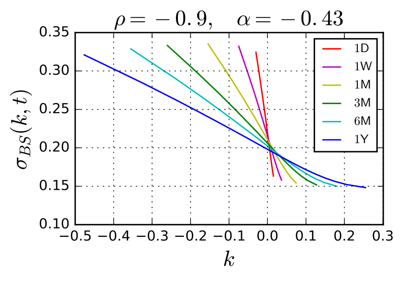
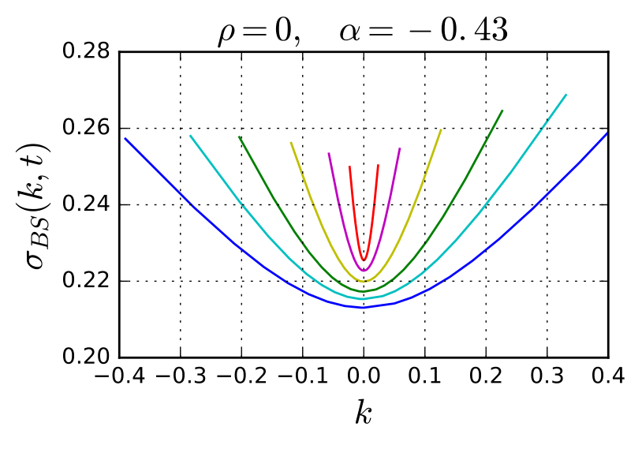

rBergomi simulation and turbocharged pricing
============================================

A Python implementation of the rough Bergomi (rBergomi) stochastic volatility model introduced by  [Bayer, Friz and Gatheral](https://ssrn.com/abstract=2554754), using the hybrid simulation scheme of [Bennedsen, Lunde and Pakkanen](https://arxiv.org/abs/1507.03004) and variance reduction pricing methods of [McCrickerd and Pakkanen](https://arxiv.org/abs/1708.02563).

Example Jupyter notebooks are included which demonstrate usage. Tested with Python 3.5.2 and macOS Sierra 10.12.5.

 
